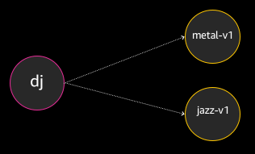
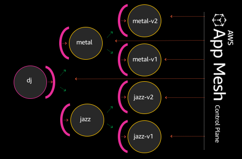
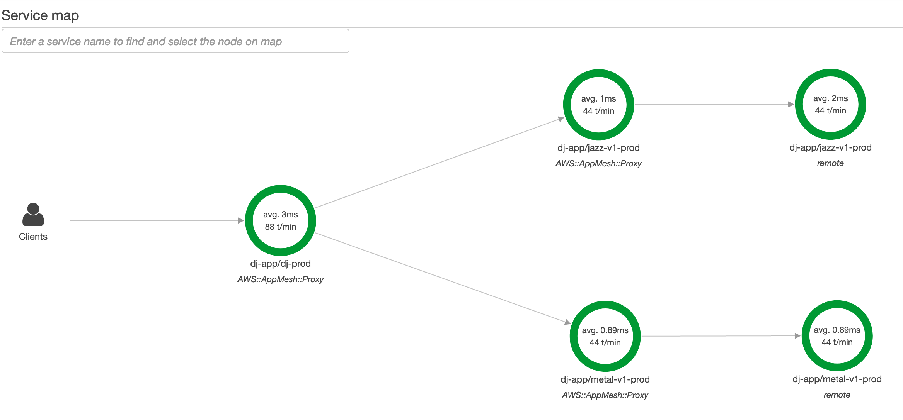
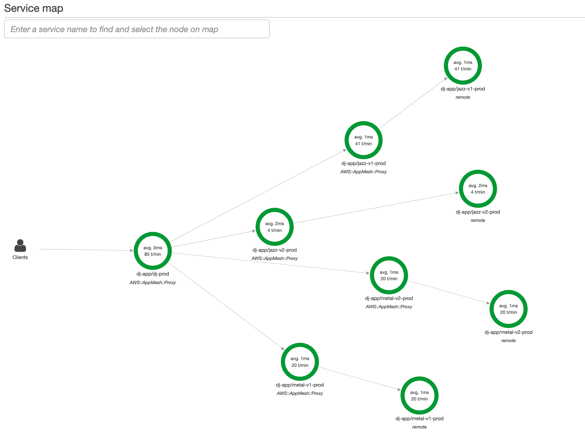

# App Mesh Routing and X-Ray Demo

This demo can be used to showcase the capabilities of [App Mesh](https://aws.amazon.com/app-mesh/) both from a routing perspective and an observability perspective utilising [AWS X-Ray](https://aws.amazon.com/xray/)

## Prerequisites


This demo can be run on a local system (macOS or Linux) or in a Cloud9 Desktop. 

The `jq` utility should be available since some scripts require it and we will be creating a cluster as part of the demo to then use for launching workloads and integrating with App Mesh. 

If using a local system use the package management capabilities of the OS to ensure that `jq` and `kubectl` are installed. Homebrew installation steps for macOS are shown below:

```bash
# install helm cli
brew install jq
```

Make sure that `kubectl` is also be installed. 

```bash
# install helm cli
brew install kubectl
```

An assumption is made that IAM keys are being used that provide a level of access to create the resources necessary. If using temporary credentials, make sure these are loaded into each terminal window you intend on using. Ideally you should have 3 windows ready, 1 for launching and modifying cluster resources and 1 each for running commands inside pods in the cluster. 

AdministratorAccess will grant sufficient privileges but is obviously not intended for production use. This tutorial at present also assumes all resources are running in the eu-west-1 region. 

If using an [AWS Cloud9 Desktop](https://eu-west-1.console.aws.amazon.com/cloud9/home?region=eu-west-1) then follow the steps at [EKS Workshop Getting Started](https://eksworkshop.com/prerequisites/workspace/) to prepare the workspace and stop after completing the step "Update IAM settings for your workspace".

# Download this repository

`git clone https://github.com/dspaxton/djapp`

Change into the djapp directory

# Launch the cluster

`eksctl create cluster -f cluster.yaml`

The contents of cluster.yaml are as follows

```
apiVersion: eksctl.io/v1alpha5
kind: ClusterConfig
metadata:
  name: appmesh-demo
  region: eu-west-1
nodeGroups:
  - name: default
    instanceType: m5.large
    desiredCapacity: 3
    iam:
      withAddonPolicies:
        albIngress: true
        autoScaler: true
        appMesh: true
        xRay: true
        cloudWatch: true
```

This is a 3 node cluster in the eu-west-1 region utilising m5.large instances and incorporating addon policies that allow access to various AWS services however we are focusing on App Mesh and X-Ray for the purposes of this demo. 

The creation process will take approximately 15 minutes to complete and will update the local kubernetes configuration file to use the new cluster by default. 


# DJ App

The DJ App demo uses a simple application called DJ to demonstrate some popular AWS App Mesh use cases.

## Overview
This application is composed of three microservices:

* dj
* metal-v1 and
* jazz-v1



The dj service makes requests to either the jazz or metal backends for artist lists. If the dj service requests from the jazz backend, musical artists such as Miles Davis or Astrud Gilberto will be returned. Requests made to the metal backend may return artists such as Judas Priest or Megadeth.

Today, dj is hardwired to make requests to metal-v1 for metal requests, and hardwired to jazz-v1 for jazz requests. Each time there is a new metal or jazz release, we also need to release a new version of dj as to point to its new upstream endpoints. It works, but it’s not an optimal configuration to maintain for the long term.

We’re going to demonstrate how App Mesh can be used to simplify this architecture; by virtualizing the metal and jazz service, we can dynamically make them route to the endpoints and versions of our choosing, minimizing the need for complete re-deployment of the DJ app each time there is a new metal or jazz service release.

When we’re done, our app will look more like the following:



Seven total services with App Mesh sidecars proxying traffic, and the App Mesh control plane managing the sidecars’ configuration rulesets.

## What We'll Cover

1. Creation of the tightly-coupled version of the application

`./stage.sh`

This will use kubectl to deploy the 3 microservices listed above. Once the command completes you can use the following command to get a shell on the dj container and make requests to one of the backend microservices (CTRL-C to quit)

`./ranCon.sh metal-v1`
and
`./ranCon.sh jazz-v1`

The responses from each command should be as described above, Judas Priest or Megadeth for metal-v1 and Astrud Gilberto or Miles Davis for jazz-v1. 

2. Start creation of the App Mesh injector Controller and Custom Resource Definitions

`./stage2.sh`

This will generate certificates to be used by the injector, configure a label that is applied to the prod namespace which will be used to load sidecar contianers and start the injector itself. 

Next it creates Custom Resource Definitions and an App Mesh controller that will keep the clusters CRD state in sync with App Mesh and then the controller itself is started. 

After this it communicated with AWS App Mesh and creates the mesh (dj-app) and sets up Virtual Nodes, Virtual Services and Virtual Routers however it hasn't switched over to them yet. 

3. Redeploy the current pods but with sidecars loaded and start using the mesh

`./stage3.sh`

This will step through the current status of the running pods and point out that in each pod only 1 container out of 1 defined is running (the worklaod itself). We will look inside the jazz pod to show what container is running and then we'll patch the deployment to force a redeploy and this will  inject the necessary components to allow the pods to utilise the mesh for transport as well as capture metrics into AWS X-Ray from the daemon that is also loaded as a sidecar. Finally it will show the new Jazz pod showing the other containers running within it. 

Go back to the terminals where the `./ranCon.sh` commands were being issued (if the command was left running it should have been interrupted) and change the service names from <service>-v1 to <service> so run:


`./ranCon.sh metal`
and
`./ranCon.sh jazz`

You should now be seeing the same returns so fundamentally the responses are the same however we are now using the mesh to route the requests to the backends and able to get telemetry from them. Another benefit of this setup is these services can now be reached from outside the kubernetes cluster by other members of the mesh whereas before they were only available within the cluster. We could have exposed them by using a LoadBalancer but this would push costs up. 

Leave these commands running in order to generate some responses for visibility in X-Ray and then open the [X-Ray Console](https://eu-west-1.console.aws.amazon.com/xray/home?region=eu-west-1)

If the "Get Started" button is displayed then you may need to click on that then cancel the next screen as X-Ray hasnt received enough requests to build the service map. Also if Service map shows nothing then you may need to click refresh a few times so it can build the map.

Ideally you should be presented with something like the following:



Here we can see the requests being routed from the dj service to the backends including how many transactions per minute and average response time. Clicking on each point in the map will load a section showing information about the responses. You can also click on Traces on the left hand side and view individual requests. Clicking on a request in the Trace List will show the full time from request to response from the DJ service itself as well as the service it was calling to. 

4. Deploy V2 services and change routing weights. 

Ok so now we are routing the requests through the Mesh however we still only have two backends but the developers want to test a new backend. The Metal team are very confident in their new version and want to shift 50% of the traffic to their V2 but the Jazz team are more cautious and only want to route 10% at this point in time. 

Execute the `./stage4.sh` script (leave the terminals running with the connections going to the metal and jazz services and when execution completes, switch to them. )

Stage 4 deploys the V2 services and tells the mesh the new routing strategies. 

The ranCon screens should soon update and provide some different responses that based on a visual inspection should represent the splits the Development teams asked for. Look at the X-Ray Console as well, you may need to switch back to Service Map and click on Refresh if it hasn't done so automatically. 

X-Ray should look something like the following:



Looking at the transactions per minute, this should again be representative of the 50/50 split for Metal and 90/10 split for Jazz.

5. Switch to V2

Lastly, execute `./stage5.sh` which will flip all traffic over to the new V2 services. 

Changing the X-Ray sampling rate to 1 minute and refreshing, you should observe that the transactions per minute for V1 is dropping until eventually the V1 services should disappear altogether. 

# Cleanup

execute `./cleanup.sh` when complete to tear down everything including the App Mesh and all k8s resources created to present this demo. 

Finally run eksctl delete cluster appmesh-demo to tear down the Cluster and the VPC created to support it. 

